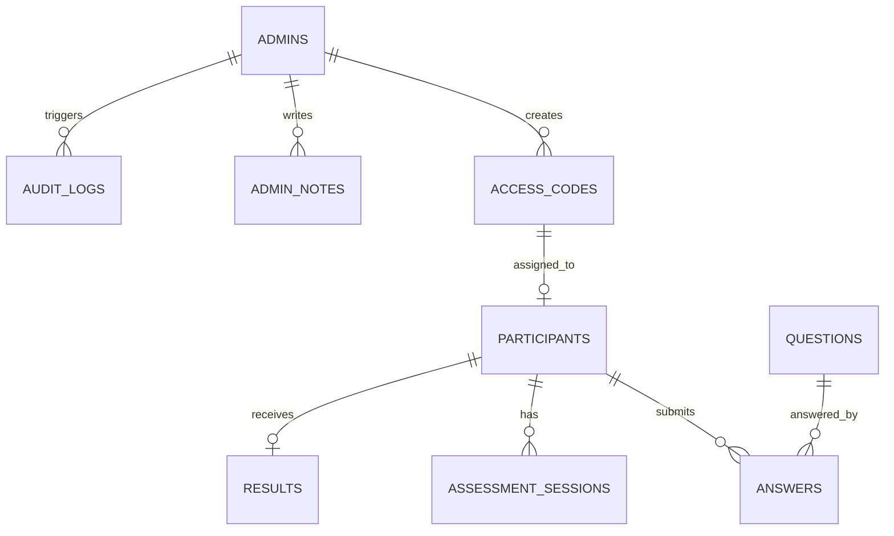

# Data Model & API Draft
# Community Fit Assessment

## Core Entities

## Suggested Tables

### admins
- id uuid primary key
- email varchar unique
- password_hash varchar
- role enum(owner, admin, moderator)
- created_at timestamp
- last_login_at timestamp

### access_codes
- id uuid primary key
- code_hash varchar unique
- display_code varchar nullable/encrypted
- status enum(Unused, In Progress, Completed, Expired, Locked)
- expires_at timestamp
- created_by uuid references admins(id)
- participant_id uuid nullable
- started_at timestamp nullable
- completed_at timestamp nullable
- locked_reason text nullable
- created_at timestamp
- updated_at timestamp

### participants
- id uuid primary key
- access_code_id uuid references access_codes(id)
- display_name varchar
- discord_username varchar
- created_at timestamp
- updated_at timestamp

### questions
- id uuid primary key
- question_number integer
- text text
- question_type enum(likert, situational)
- category varchar
- scoring_direction enum(normal, reverse, situational)
- is_consistency_item boolean
- is_active boolean
- created_at timestamp

### answers
- id uuid primary key
- participant_id uuid references participants(id)
- question_id uuid references questions(id)
- answer_value varchar
- score_value integer nullable
- revision integer default 1
- saved_at timestamp
- unique(participant_id, question_id)

### assessment_sessions
- id uuid primary key
- participant_id uuid references participants(id)
- session_token_hash varchar
- device_id varchar
- user_agent text
- ip_hash varchar nullable
- started_at timestamp
- last_seen_at timestamp
- refresh_count integer default 0
- resume_count integer default 0
- is_active boolean

### results
- id uuid primary key
- participant_id uuid references participants(id)
- community_fit_score integer
- competitive_fit_score integer
- risk_level enum(Low, Medium, High)
- honesty_status enum(Valid, Questionable, Invalid)
- member_type varchar
- final_status varchar
- category_scores jsonb
- red_flags jsonb
- suspicious_flags jsonb
- generated_at timestamp
- overridden_by uuid nullable
- override_reason text nullable

### admin_notes
- id uuid primary key
- participant_id uuid references participants(id)
- admin_id uuid references admins(id)
- note text
- created_at timestamp

### audit_logs
- id uuid primary key
- actor_id uuid references admins(id)
- action varchar
- entity_type varchar
- entity_id uuid
- before_data jsonb nullable
- after_data jsonb nullable
- created_at timestamp

## API Draft

### Participant
- POST /api/code/validate
- POST /api/assessment/start
- GET /api/assessment/current
- PUT /api/answers/autosave
- POST /api/assessment/submit
- GET /api/assessment/completion

### Admin
- POST /api/admin/login
- POST /api/admin/codes
- POST /api/admin/codes/batch
- GET /api/admin/codes
- PATCH /api/admin/codes/:id/reset
- PATCH /api/admin/codes/:id/lock
- PATCH /api/admin/codes/:id/unlock
- GET /api/admin/participants
- GET /api/admin/participants/:id/result
- POST /api/admin/participants/:id/notes
- PATCH /api/admin/participants/:id/final-status
- GET /api/admin/export/results.csv
- GET /api/admin/audit-logs
